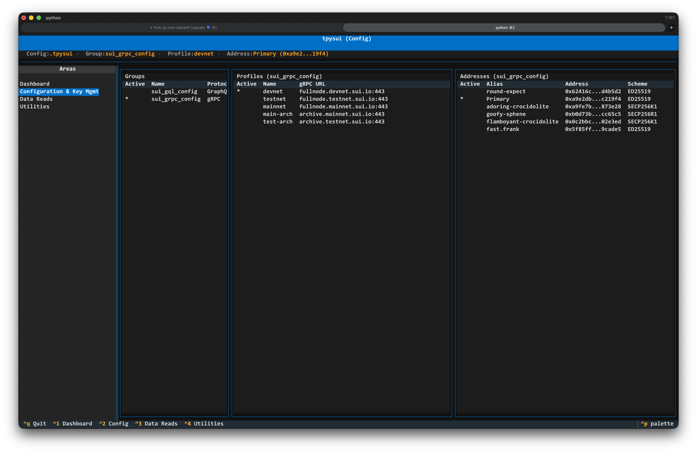

============================
Configuration & Key Mgmt
============================

The Configuration & Key Mgmt area manages the full structure of a
``PysuiConfig.json`` file: groups, profiles (network endpoints), and
addresses (keys).

Access with ``Ctrl+2`` or by selecting **Configuration & Key Mgmt** in
the sidebar.

.. contents:: Contents
   :depth: 2

Overview
--------

A PysuiConfig is organized as a three-level hierarchy:

- **Groups** — named sets of profiles and addresses (e.g. ``sui_gql_config``)
- **Profiles** — network endpoint URLs within a group
- **Addresses** — key pairs (addresses) available within a group

The screen (see screenshot above) shows three tables side by side: Groups on the
left, Profiles in the centre, and Addresses on the right. Highlighting a group row
automatically populates the Profiles and Addresses tables for that group.

The active item in each table is marked with ``*``.

Keyboard actions apply to whichever table currently has focus:

.. list-table::
   :header-rows: 1
   :widths: 20 80

   * - Key
     - Action
   * - ``n``
     - New — create a group, profile, or address depending on focus
   * - ``e``
     - Edit — edit the selected profile URL or address alias
   * - ``d``
     - Delete — delete the selected row
   * - ``a``
     - Set Active — make the selected group, profile, or address the active one

Groups
------

Creating a Group
^^^^^^^^^^^^^^^^

Focus the Groups table and press ``n``. A dialog prompts for the group name and
protocol type (GraphQL or gRPC). Standard Mysten profile URLs are populated
automatically.

Editing a Group
^^^^^^^^^^^^^^^

Group names cannot be edited directly. Use ``a`` to change the active group.

Deleting a Group
^^^^^^^^^^^^^^^^

Focus the Groups table, select a group, and press ``d``. Deleting a group removes
all its profiles and addresses. The last remaining group cannot be deleted.

Profiles
--------

Profiles are network endpoint URLs (GraphQL or gRPC) within a group.

Creating a Profile
^^^^^^^^^^^^^^^^^^

Focus the Profiles table and press ``n``. Enter the profile name and URL in the
dialog that appears.

Editing and Deleting
^^^^^^^^^^^^^^^^^^^^

Focus the Profiles table, select a profile, and press ``e`` to edit its URL or
``d`` to delete it.

Addresses
---------

Addresses represent key pairs (public/private keys) available for signing
transactions within a group.

Creating an Address
^^^^^^^^^^^^^^^^^^^

Focus the Addresses table and press ``n``. Choose **Generate Keypair** to create
a new key pair (you will be prompted for an alias and shown the mnemonic phrase),
or **Import** to import an existing private key with an alias.

Editing and Deleting
^^^^^^^^^^^^^^^^^^^^

Focus the Addresses table, select an address, and press ``e`` to rename its alias
or ``d`` to delete it.

Use ``a`` to make an address the active signing address for the group.
