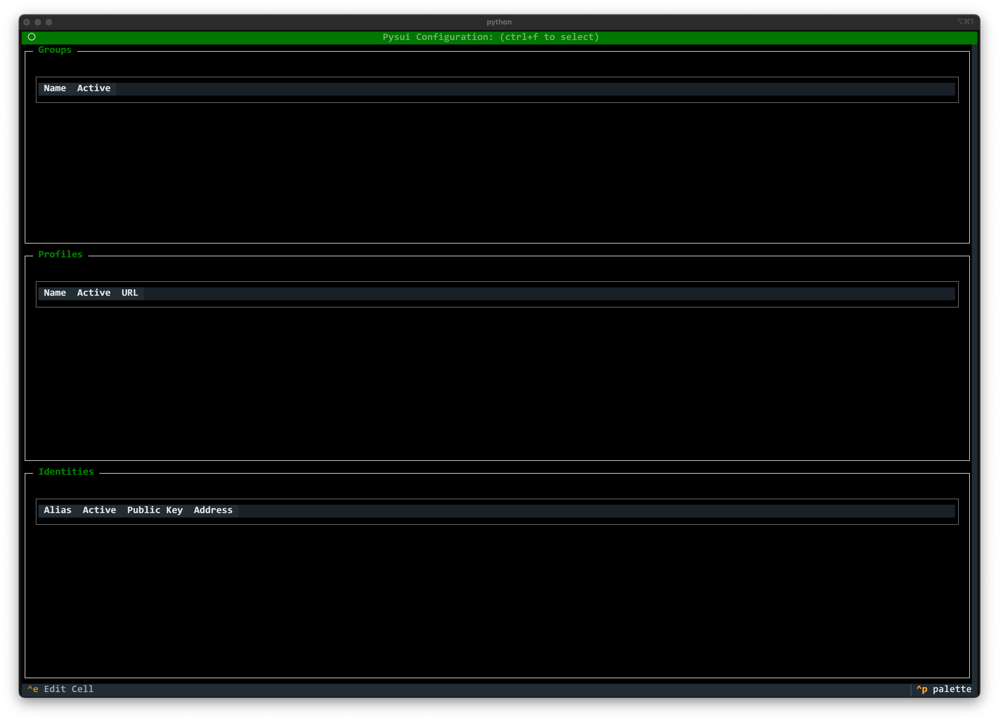

====================================================================
tpysui - Pysui TUI application to manage Pysui or Sui Configurations
====================================================================

BETA BETA BETA

.. contents:: Operations
    :depth: 2

Startup
-------
When you first run ``tpysui`` you are presented with the PysuiConfiguration
management screen screen as shown below.

You can switch between the two configuration types to manage:

* Pressing the "m" key - switches to Mysten Sui client.yaml management screen.
* Pressing the "c" key - switches to PysuiConfiguration management screen.

Example of Mysten Sui (client.yanl) after pressing "m"

.. image:: ./main_mysten_screen.png
   :width: 800px
   :height: 800px
   :alt: Mysten client.yaml

Create new config (ctrl+n)
------------------------------------
This is only available in PysuiConfiguration management.

If you are a first time user of ``pysui`` then you may want
to choose this option.

Select an existing configuration (ctrl+f)
-----------------------------------------

This will popup a file picker for selecting a configuration file

For PysuiConfiguration you can select a PysuiConfig.json file.
For Mysten Sui you can select a client.yaml file.

Save a copy (ctrl+s)
--------------------
This is only available for PysuiConfiguration management.

This option is available after creating or loading a PysuiConfig.json file.

Adds, Edits, Deletes
--------------------

Add Table Entry (ctrl+a)
************************
PysuiConfiguration only!

With a loaded configuration, this will add a new entry (row in table) based
on where the focus is between Group, Profile and Identity.
A relevant dialog box for the entry type will pop up.

Add gRPC Group (ctrl+r)
^^^^^^^^^^^^^^^^^^^^^^^
PysuiConfiguration only! Note: This button is disabled if said group
already exists.

This will add a group: ``sui_grpc_config`` with standard
Mysten gRPC profiles (URLS).

If there are other groups that have identities, a popup will
ask if you want to copy identities from one of them. Otherwise,
you will need to add Identities for addresses/keys.

Add GraphQL Group (ctrl+l)
^^^^^^^^^^^^^^^^^^^^^^^^^^
PysuiConfiguration only! Note: This button is disabled if said group
already exists.

This will add a group: ``sui_gql_config`` with standard
Mysten GraphQL profiles (URLS).

If there are other groups that have identities, a popup will
ask if you want to copy identities from one of them. Otherwise,
you will need to add Identities for addresses/keys.

Note about Identities
^^^^^^^^^^^^^^^^^^^^^
The dialog supports generating identies for ED25199, SECP256k1 or SECP256r1

Field Edits (ctrl+e)
********************
Selecting a field in any table and then pressing ``ctrl+e`` keys allows
you to change that field.

Groups
^^^^^^
PysuiConfiguration only!

You can change the Name or Active status.

Profiles/Environments
^^^^^^^^^^^^^^^^^^^^^
You can change the Name, Active status and/or URL.

Identities
^^^^^^^^^^
You can change the Alias or Active status.

Delete Rows
***********
With a row in focs, right clicking will popup options to edit the highlighted
cell or delete the row.

Deleting a row in the Group section will remove the entire row and any
relateded content. For example, deleting a Group will delete all
the Profiles and Identities that belong to it.

Deleting the only row in the Group section is not allowed.

Quitting ``tpysui`` (ctrl+q)
----------------------------
Will exit the application and return you to the command line.
